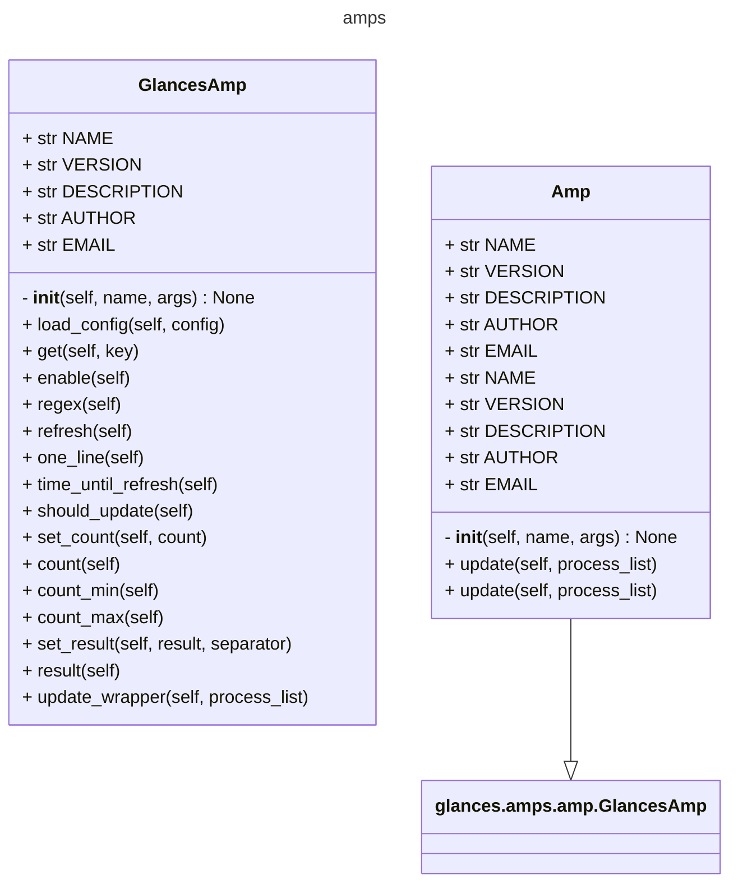

```mermaid
---
title: amps
---
classDiagram
    class GlancesAmp {
        + str NAME
        + str VERSION
        + str DESCRIPTION
        + str AUTHOR
        + str EMAIL
        - __init__(self, name, args) None
        + load_config(self, config)
        + get(self, key)
        + enable(self)
        + regex(self)
        + refresh(self)
        + one_line(self)
        + time_until_refresh(self)
        + should_update(self)
        + set_count(self, count)
        + count(self)
        + count_min(self)
        + count_max(self)
        + set_result(self, result, separator)
        + result(self)
        + update_wrapper(self, process_list)
    }

    class Amp {
        + str NAME
        + str VERSION
        + str DESCRIPTION
        + str AUTHOR
        + str EMAIL
        - __init__(self, name, args) None
        + update(self, process_list)
    }

    class Amp {
        + str NAME
        + str VERSION
        + str DESCRIPTION
        + str AUTHOR
        + str EMAIL
        + update(self, process_list)
    }

    Amp --|> `glances.amps.amp.GlancesAmp`
```
