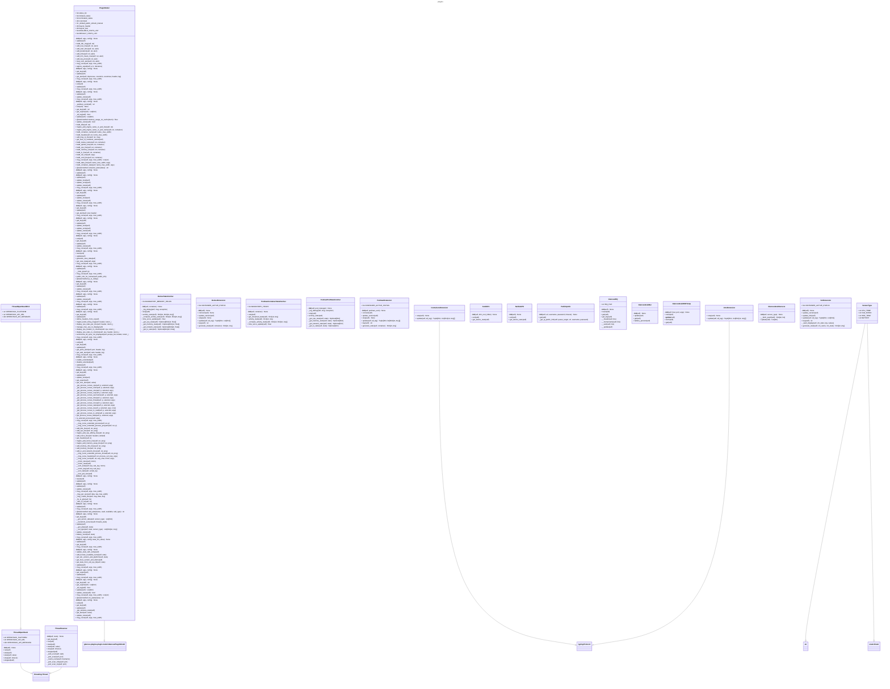

```mermaid
---
title: plugins
---
classDiagram
    class PluginModel {
        - __init__(self, args, config) None
        + update(self)
        + build_hdr_msg(self, ret)
        + add_new_line(self, ret, alert)
        + add_start_time(self, ret, alert)
        + add_duration(self, ret, alert)
        + add_infos(self, ret, alert)
        + add_min_mean_max(self, ret, alert)
        + add_top_proc(self, ret, alert)
        + loop_over_alert(self, init, alert)
        + msg_curse(self, args, max_width)
        + approx_equal(self, a, b, tolerance)
    }

    class PluginModel {
        - __init__(self, args, config) None
        + get_key(self)
        + update(self)
        + get_alert(self, nbprocess, countmin, countmax, header, log)
        + msg_curse(self, args, max_width)
    }

    class PluginModel {
        - __init__(self, args, config) None
        + exit(self)
        + update(self)
        + msg_curse(self, args, max_width)
    }

    class ThreadOpenStack {
        + str OPENSTACK_PLATFORM
        + str OPENSTACK_API_URL
        + dict OPENSTACK_API_METADATA
        - __init__(self) None
        + run(self)
        + stats(self)
        + stats(self, value)
        + stop(self, timeout)
        + stopped(self)
    }

    class ThreadOpenStackEC2 {
        + str OPENSTACK_PLATFORM
        + str OPENSTACK_API_URL
        + dict OPENSTACK_API_METADATA
    }

    class PluginModel {
        + list status_list
        + list initiated_states
        + list terminated_states
        + dict conntrack
        - __init__(self, args, config) None
        + update(self)
        + update_views(self)
        + msg_curse(self, args, max_width)
    }

    class DockerStatsFetcher {
        + list MANDATORY_MEMORY_FIELDS
        - __init__(self, container) None
        - _log_debug(self, msg, exception)
        + stop(self)
        + activity_stats(self) Dict[str, Dict[str, Any]]
        - _compute_activity_stats(self) Dict[str, Dict[str, Any]]
        + time_since_update(self) float
        - _get_cpu_stats(self) Optional[Dict[str, float]]
        - _get_memory_stats(self) Optional[Dict[str, float]]
        - _get_network_stats(self) Optional[Dict[str, float]]
        - _get_io_stats(self) Optional[Dict[str, float]]
    }

    class DockerExtension {
        + list CONTAINER_ACTIVE_STATUS
        - __init__(self) None
        + connect(self) None
        + update_version(self)
        + stop(self) None
        + update(self, all_tag) Tuple[Dict, List[Dict]]
        + key(self) str
        + generate_stats(self, container) Dict[str, Any]
    }

    class PodmanContainerStatsFetcher {
        + list MANDATORY_FIELDS
        - __init__(self, container) None
        + stop(self)
        + get_streamed_stats(self) Dict[str, Any]
        + activity_stats(self) Dict[str, Any]
        - _compute_activity_stats(self) Dict[str, Dict[str, Any]]
        + time_since_update(self) float
    }

    class PodmanPodStatsFetcher {
        - __init__(self, pod_manager) None
        - _log_debug(self, msg, exception)
        + stop(self)
        + activity_stats(self)
        - _get_cpu_stats(self, stats) Optional[Dict]
        - _get_memory_stats(self, stats) Optional[Dict]
        - _get_network_stats(self, stats) Optional[Dict]
        - _get_io_stats(self, stats) Optional[Dict]
    }

    class PodmanExtension {
        + list CONTAINER_ACTIVE_STATUS
        - __init__(self, podman_sock) None
        + connect(self)
        + update_version(self)
        + stop(self) None
        + update(self, all_tag) Tuple[Dict, list[Dict[str, Any]]]
        + key(self) str
        + generate_stats(self, container) Dict[str, Any]
    }

    class ContainersExtension {
        + stop(self) None
        + update(self, all_tag) Tuple[Dict, List[Dict[str, Any]]]
    }

    class PluginModel {
        - __init__(self, args, config) None
        - _podman_sock(self) str
        + exit(self) None
        + get_key(self) str
        + get_export(self) List[Dict]
        - _all_tag(self) bool
        + update(self) List[Dict]
        + @staticmethod memory_usage_no_cache(mem) float
        + update_views(self) bool
        + build_title(self, ret)
        + maybe_add_engine_name_or_pod_line(self, ret)
        + maybe_add_engine_name_or_pod_name(self, ret, container)
        + build_container_name(self, name_max_width)
        + build_header(self, ret, name_max_width)
        + add_msg_to_line(self, ret, msg)
        + get_max_of_container_names(self)
        + build_status_name(self, ret, container)
        + build_uptime_line(self, ret, container)
        + build_cpu_line(self, ret, container)
        + build_memory_line(self, ret, container)
        + build_io_line(self, ret, container)
        + build_net_line(self, args)
        + build_cmd_line(self, ret, container)
        + msg_curse(self, args, max_width) List[str]
        + build_data_line(self, name_max_width, args)
        + build_container_data(self, name_max_width, args)
        + @staticmethod container_alert(status) str
    }

    class PluginModel {
        - __init__(self, args, config) None
        + update(self)
    }

    class PluginModel {
        - __init__(self, args, config) None
        + update(self)
        + update_local(self)
        + update_snmp(self)
        + update_views(self)
        + msg_curse(self, args, max_width)
    }

    class PluginModel {
        - __init__(self, args, config) None
        + get_key(self)
        + update(self)
        + update_local(self)
        + update_views(self)
        + msg_curse(self, args, max_width)
    }

    class PluginModel {
        - __init__(self, args, config) None
        + get_key(self)
        + update(self)
        + get_alert(self, stat, header)
        + msg_curse(self, args, max_width)
    }

    class PluginModel {
        - __init__(self, args, config) None
        + get_key(self)
        + update(self)
        + update_local(self)
        + update_snmp(self)
        + update_views(self)
        + msg_curse(self, args, max_width)
    }

    class AmdGPU {
        - __init__(self, drm_root_folder) None
        + exit(self)
        + get_device_stats(self)
    }

    class NvidiaGPU {
        - __init__(self) None
        + exit(self)
        + get_device_stats(self)
    }

    class PluginModel {
        - __init__(self, args, config) None
        + exit(self)
        + get_key(self)
        + update(self)
        + update_views(self)
        + msg_curse(self, args, max_width)
    }

    class PluginModel {
        - __init__(self, args, config) None
        + reset(self)
        + update(self)
        + generate_view_data(self)
        + get_view_data(self, args)
        + msg_curse(self, args, max_width)
    }

    class PluginModel {
        + int _default_public_refresh_interval
        - __init__(self, args, config) None
        + update(self)
        - __hide_ip(self, ip)
        + msg_curse(self, args, max_width)
        + public_info_for_human(self, public_info)
        + @staticmethod ip_to_cidr(ip)
    }

    class PublicIpInfo {
        - __init__(self, url, username, password, timeout) None
        + get(self)
        - _get_ip_public_info(self, queue_target, url, username, password)
    }

    class PluginModel {
        - __init__(self, args, config) None
        + get_key(self)
        + update(self)
        + update_views(self)
        + msg_curse(self, args, max_width)
    }

    class GlancesIRQ {
        + str IRQ_FILE
        - __init__(self) None
        + reset(self)
        + get(self)
        + get_key(self)
        - __header(self, line)
        - __humanname(self, line)
        - __sum(self, line)
        - __update(self)
    }

    class PluginModel {
        - __init__(self, args, config) None
        + update(self)
        + update_views(self)
        + msg_curse(self, args, max_width)
    }

    class PluginModel {
        - __init__(self, args, config) None
        + update(self)
        + msg_curse(self, args, max_width)
    }

    class PluginModel {
        - __init__(self, args, config) None
        + get_key(self)
        + update(self)
        + define_headers_from_os(self)
        + maybe_build_string_msg(self, header, return_)
        + display_cpu_stats_per_line(self, header, return_)
        + manage_max_cpu_to_display(self)
        + display_cpu_header_in_columns(self, cpu, return_)
        + display_cpu_stats_in_columns(self, cpu, header, return_)
        + summarize_all_cpus_not_displayed(self, percpu_list, header, return_)
        + msg_curse(self, args, max_width)
    }

    class PluginModel {
        - __init__(self, args, config) None
        + exit(self)
        + get_key(self)
        + update(self)
        + get_ports_alert(self, port, header, log)
        + get_web_alert(self, web, header, log)
        + msg_curse(self, args, max_width)
    }

    class ThreadScanner {
        - __init__(self, stats) None
        + get_key(self)
        + run(self)
        + stats(self)
        + stats(self, value)
        + stop(self, timeout)
        + stopped(self)
        - _web_scan(self, web)
        - _port_scan(self, port)
        - _resolv_name(self, hostname)
        - _port_scan_icmp(self, port)
        - _port_scan_tcp(self, port)
    }

    class PluginModel {
        - __init__(self, args, config) None
        + enable_extended(self)
        + disable_extended(self)
        + update(self)
        + msg_curse(self, args, max_width)
    }

    class PluginModel {
        + dict layout_header
        + dict layout_stat
        - __init__(self, args, config) None
        + get_key(self)
        + update(self)
        + update_local(self)
        + get_export(self)
        + get_nice_alert(self, value)
        - _get_process_curses_cpu(self, p, selected, args)
        - _get_process_curses_mem(self, p, selected, args)
        - _get_process_curses_vms(self, p, selected, args)
        - _get_process_curses_rss(self, p, selected, args)
        - _get_process_curses_username(self, p, selected, args)
        - _get_process_curses_time(self, p, selected, args)
        - _get_process_curses_thread(self, p, selected, args)
        - _get_process_curses_nice(self, p, selected, args)
        - _get_process_curses_status(self, p, selected, args)
        - _get_process_curses_io(self, p, selected, args, rorw)
        - _get_process_curses_io_read(self, p, selected, args)
        - _get_process_curses_io_write(self, p, selected, args)
        + get_process_curses_data(self, p, selected, args)
        + is_selected_process(self, args)
        + msg_curse(self, args, max_width)
        - __msg_curse_extended_process(self, ret, p)
        - __msg_curse_extended_process_program(self, ret, p)
        + add_title_line(self, ret, prog)
        + add_cpu_line(self, ret, prog)
        + maybe_add_cpu_affinity_line(self, ret, prog)
        + add_ionice_line(self, headers, default)
        + get_headers(self, k)
        + maybe_add_ionice_line(self, ret, prog)
        + maybe_add_memory_swap_line(self, ret, prog)
        + add_memory_info_lines(self, ret, prog)
        + add_memory_line(self, ret, prog)
        + add_io_and_network_lines(self, ret, prog)
        - __msg_curse_extended_process_thread(self, ret, prog)
        - __msg_curse_header(self, ret, process_sort_key, args)
        - __msg_curse_sum(self, ret, sep_char, mmm, args)
        - __mmm_deco(self, mmm)
        - __mmm_reset(self)
        - __sum_stats(self, key, sub_key, mmm)
        - __mmm_key(self, key, sub_key)
        - __sort_stats(self, sorted_by)
        - __max_pid_size(self)
    }

    class PluginModel {
        - __init__(self, args, config) None
        + reset(self)
        + update(self)
    }

    class PluginModel {
        + list AVAILABLE_STATS_LIST
        + list DEFAULT_STATS_LIST
        - __init__(self, args, config) None
        + update(self)
        + update_views(self)
        + msg_curse(self, args, max_width)
        - _msg_per_cpu(self, data, key, max_width)
        - _msg_create_line(self, msg, data, key)
        - _hz_to_ghz(self, hz)
        - _mhz_to_hz(self, hz)
    }

    class PluginModel {
        - __init__(self, args, config) None
        + update(self)
        + msg_curse(self, args, max_width)
        + @staticmethod raid_alert(status, used, available, raid_type) str
    }

    class GlancesGrabBat {
        - __init__(self) None
        + update(self)
        + get(self)
        + battery_percent(self)
    }

    class GlancesGrabHDDTemp {
        - __init__(self, host, port, args) None
        + reset(self)
        - __update__(self)
        + fetch(self)
        + get(self)
    }

    class SensorType {
        + str CPU_TEMP
        + str FAN_SPEED
        + str HDD_TEMP
        + str BATTERY
    }

    class PluginModel {
        - __init__(self, args, config) None
        + get_key(self)
        - __get_sensor_data(self, sensor_type) List[Dict]
        - __transform_sensors(self, threads_stats)
        + update(self)
        - __get_alias(self, stats)
        - __set_type(self, stats, sensor_type) List[Dict[str, Any]]
        + update_views(self)
        + battery_trend(self, stats)
        + msg_curse(self, args, max_width)
    }

    class GlancesGrabSensors {
        - __init__(self, sensor_type) None
        - __fetch_psutil(self) Dict[str, list]
        + update(self) List[dict]
    }

    class PluginModel {
        - __init__(self, args, config, stats_init_value) None
        + update(self)
        + get_key(self)
        + msg_curse(self, args, max_width)
    }

    class PluginModel {
        - __init__(self, args, config) None
        + update_stats_with_snmp(self)
        + add_human_readable_name(self, stats)
        + get_win_version_and_platform(self, stats)
        + get_linux_version_and_distro(self)
        + get_stats_from_std_sys_lib(self, stats)
        + update(self)
        + msg_curse(self, args, max_width)
    }

    class PluginModel {
        - __init__(self, args, config) None
        + get_export(self)
        + update(self)
        + msg_curse(self, args, max_width)
    }

    class VmExtension {
        + list CONTAINER_ACTIVE_STATUS
        - __init__(self) None
        + update_version(self)
        + update_info(self)
        + update(self, all_tag) Tuple[Dict, List[Dict]]
        + key(self) str
        - _want_display(self, vm_stats, key, values)
        + generate_stats(self, vm_name, vm_stats) Dict[str, Any]
    }

    class VmsExtension {
        + stop(self) None
        + update(self, all_tag) Tuple[Dict, List[Dict[str, Any]]]
    }

    class PluginModel {
        - __init__(self, args, config) None
        + get_key(self) str
        + get_export(self) List[Dict]
        - _all_tag(self) bool
        + update(self) List[Dict]
        + update_views(self) bool
        + msg_curse(self, args, max_width) List[str]
        + @staticmethod vm_alert(status) str
    }

    class PluginModel {
        - __init__(self, args, config) None
        + exit(self)
        + get_key(self)
        + update(self)
        - _get_wireless_stats(self)
        + get_alert(self, value)
        + update_views(self)
        + msg_curse(self, args, max_width)
    }

    PluginModel --|> `glances.plugins.plugin.model.GlancesPluginModel`

    ThreadOpenStack --|> `threading.Thread`

    ThreadOpenStackEC2 --|> ThreadOpenStack

    ContainersExtension --|> `typing.Protocol`

    ThreadScanner --|> `threading.Thread`

    SensorType --|> str

    SensorType --|> `enum.Enum`

    VmsExtension --|> `typing.Protocol`
```
